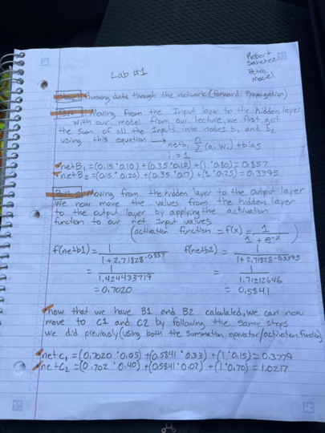
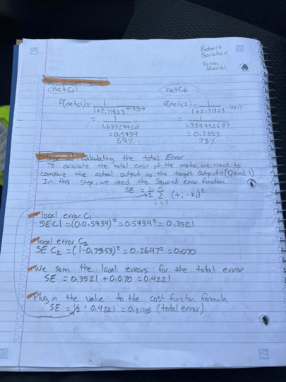
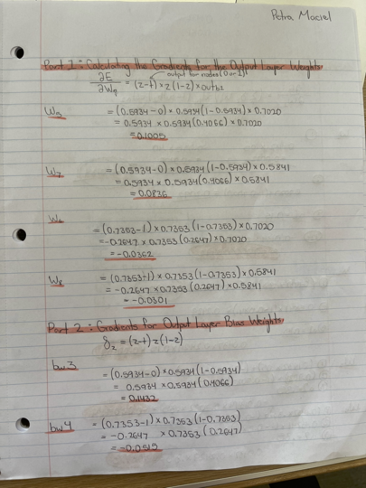
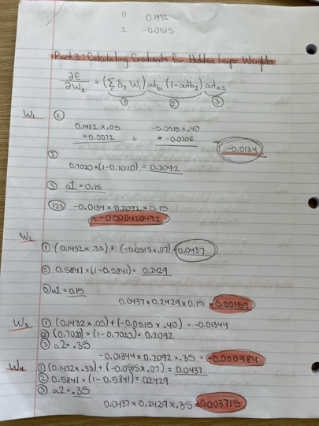
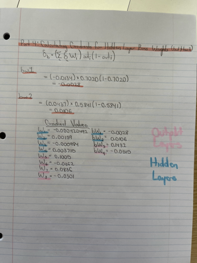
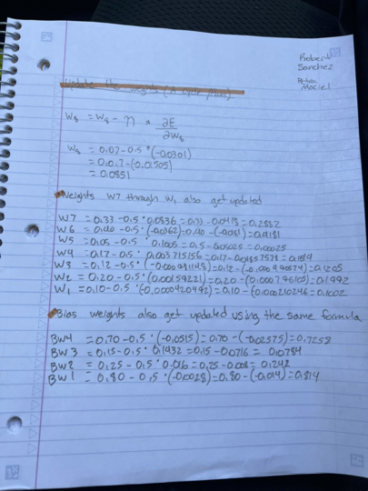

# IS160_AI_In_Business_PetraMaciel
## Collection of labs completed in IS160, AI in Business, course. 

##LAB 1: Manual Calculation of DL
Lab 1 was on manually calculating Deep Learning with our partners. The DL calculation example in the Michael Tayler book was used. We put down weight and bias weight calculations, summations, the activation function, total error, and gradients. Below are images of our written work on the calculation.

##LAB 2: Deep Learning CNN with Dot Product

